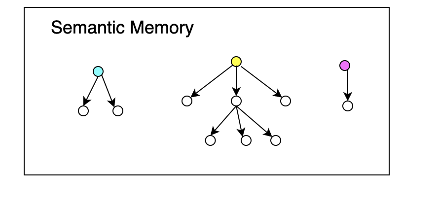
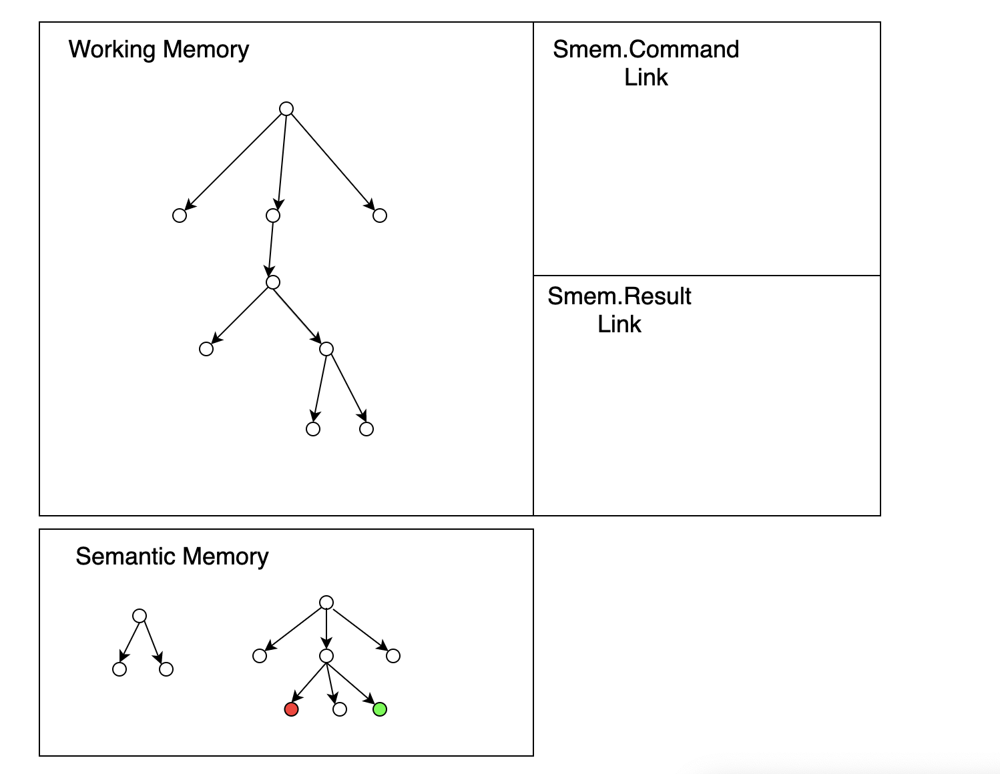
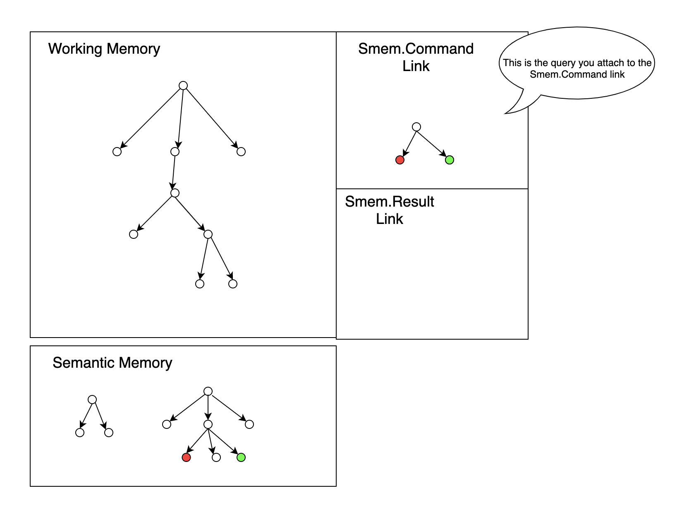
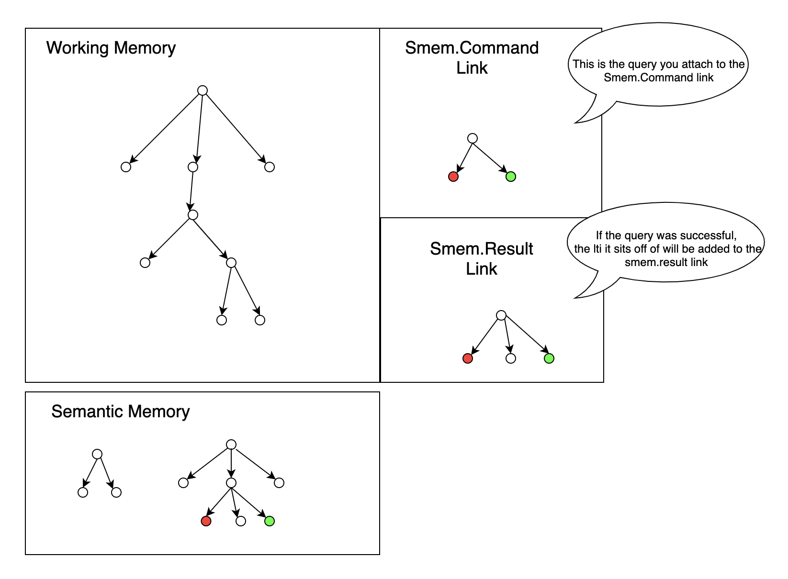
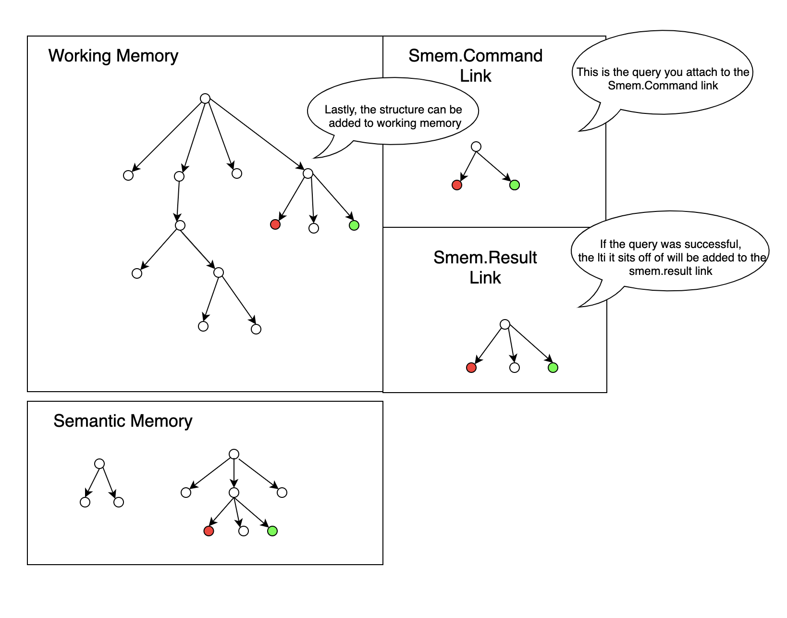
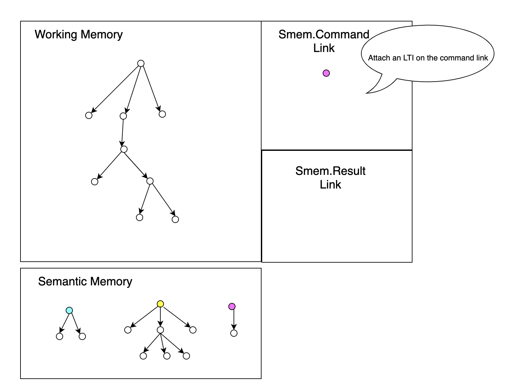
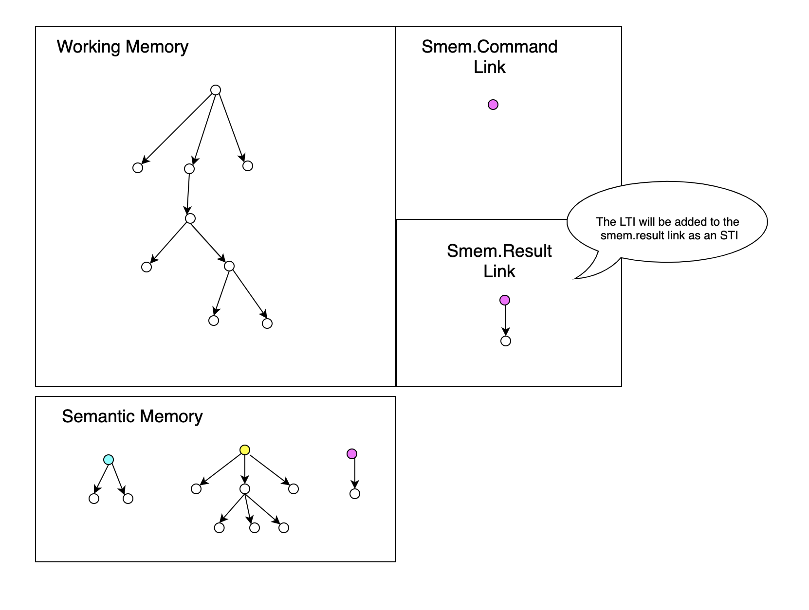
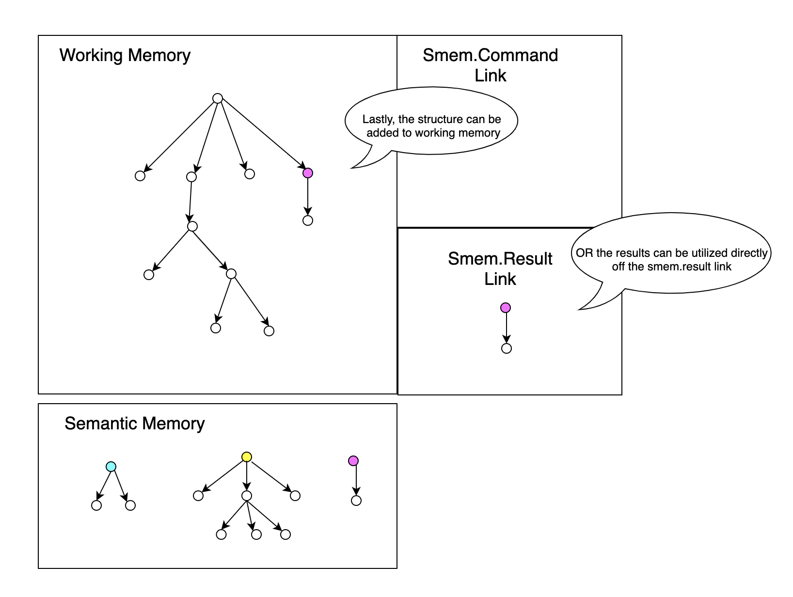

# Overview of Semantic Memory:

Another memory in the Soar Architecture is semantic memory. This is used for storing long term knowledge and facts. For example 'red is a color', 'fire is hot', 'the sky is blue'. It would be inappropriate to store this type of memory in the Working Memory, as this knowledge is not always necessary.

### How would you store this type of information? 

Surprisingly, it takes on a format similar to the structure of working memory. Soar's semantic memory utilizes a graph structure to store knowledge. Unlike the Working Memory, the Semantic Memory can store a series of multiple disconnected graphs. These graphs are not connected to the working memory initially. 



Soar constructs the Semantic Memory out of identifiers. Similar to the Working Memory Identifiers, these are 'nodes' that help layout the data. Identifiers in the Semantic Memory are referred to as Long Term Identifiers (LTI). These exist only in the Semantic Memory. Each LTI is labeled with an @ and a number (@5, @7, etc), the number assigned to it is permanent. LTIs never exist in working memory, but can be added to working memory as a short-term identifiers (STIs), through a query or direct retrieval. 

### How would you retrieve this type of information? 

How are we able to retrieve this knowledge from the semantic memory? There are multiple methods we will discuss in detail, but both methods rely on built-in links in working memory. The standard graph of working memory shows an attribute ^smem. Branching off smem we find attributes ^command and ^result.
	- On the ^command attribute you can specify the LTI you want to grab, or conditions the LTI must satisfy. 
	- On the ^results attribute, the LTI grabbed by the ^command attribute are placed. 



- Each time you load an LTI into working memory, the STI created will always be unique. This means that if the same LTI is retrieved multiple times, each retrieval points to a unique STI instance in working memory. STIs can be modified in working memory, but this has no effect on the linked LTI in semantic memory. 


## Retrieving Semantic Knowledge:

### Cue-Based Retrievals

When you don't know what LTI you want to grab, but instead have a criteria that an LTI must satisfy, you should use cue-based retrieval to access the contents of semantic memory. 

With cue-based retrieval, you attach a set of criteria to a query and attach the query to the command link. SOAR will look through semantic memory for an LTI that satisfies your criteria. If it is successful, the result is available to use on the command link. 


													         
	
		sp {propose*cue-based-retrieval                         
		    (state <s> ^superstate nil
		    		  -^name)
		-->
			(<s> ^operator <o>)
			(<o> ^name cue-based-retrieval)
		}					

When the rule is executed Soar looks through semantic memory for any LTI's that match the query, and if it's successful will make the results available. 

		sp {apply*cue-based-retrieval 
			(state <s> ^operator <o>)
			(<o> ^name cue-based-retrieval)
			(<s> ^smem <smem>)  
			(<smem> ^command <cmd>)                 	 
		-->												
			(<cmd> ^query <q>)                            	
			(<q> ^attr1 val1                               		
			     ^attr2 <val2>                               	 
			     ^attr3 @V3 …)						     
		}


Before you can use the results of the query, it's a good idea to ensure that the query was successful. To ensure that the query was successful, check the smem.result.success link in the proposal operator.  The query results can then be added into working memory through, provided the query was successful.  


		sp {propose*access-query-results
		    (state <s> ^smem.result.success <cue>)
		-->
		    (<s> ^operator <o> +)
		    (<o> ^name access-query-results)
		}

Now when the rule is executed Soar looks through semantic memory for any LTI's that match the query, and if it's successful stores the LTI as an STI on the smem.results.retrieved link.




After pulling the results of the query, we can place it into working memory, by attaching the STI on an attribute ^semantic-query-results on state ```<s>```. 



		
		sp {apply*access-query-results
		    (state <s> ^operator.name access-query-results
		               ^smem <smem>)
		    (<smem> ^command <cmd>
		            ^result.retrieved <lti>)
		    (<cmd> ^query <q>)
		-->
		    (<s> ^semantic-query-results <lti>)
		    (<cmd> ^query <q> -)
		}

Once this is completed, you need to clear up smem command link in order to use it again (in the future).  


Alternatively, you do not need to store the results in working memory if you don't want to. If you know the structure of the semantic memory that you pulled in, you can access attribute/values directly off the smem.results.retrieved link.  


### Non-cue based retrieval


With non-cue based retrievals, you are searching semantic memory for a LTI. 








